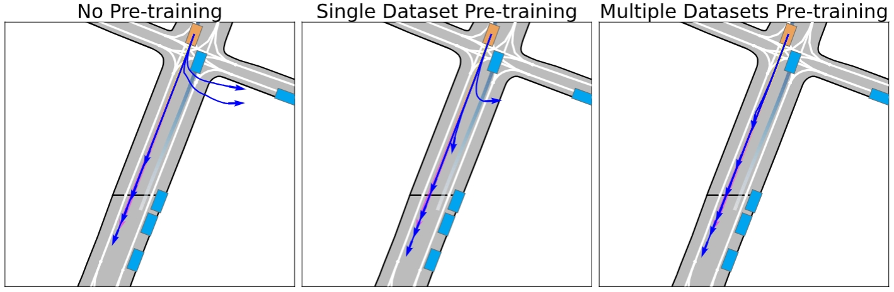

# SmartPretrain: Model-Agnostic and Dataset-Agnostic Representation Learning for Motion Prediction

***“Unlock the Future of Motion Prediction with Scalable, Model-Agnostic, Dataset-Agnostic Innovation!”*** 


This repository contains the official implementation of [SmartPretrain: Model-Agnostic and Dataset-Agnostic Representation Learning for Motion Prediction](https://arxiv.org/abs/2410.08669) published in _ICLR 2025_.

[](https://hits.seeyoufarm.com)

[](https://github.com/tatsu-lab/stanford_alpaca/blob/main/LICENSE)

## News

- `[Mar., 2025]` We released our code based on [QCNet](https://github.com/ZikangZhou/QCNet) for [Argoverse 2](https://github.com/argoverse/av2-api). Give it a try!
- `[Jan., 2025]` Our SmartPretrain was accepted by _ICLR 2025_.
- `[Oct., 2024]` We released our SmartPretrain paper on [<u>_arXiv_</u>](https://arxiv.org/abs/2410.08669).

## **_What We Do_:** 

1. The project focuses on utilizing SSL strategies and large-scale driving datasets to develop robust and generalizable motion prediction models. The proposed framework, integrating contrastive and reconstructive SSL techniques, is both ***model-agnostic and dataset-agnostic***. 
2.  We aim to invest in an early exploration of the ***scaling laws*** in the motion prediction domain, an area that has been significantly underexplored.
3. Extensive experiments on multiple datasets demonstrate that our method consistently improves the performance of state-of-the-art prediction models across datasets, data splits and main metrics.

## 0. Intuitive Cases

We present visualization results to demonstrate the effectiveness of our method. The blue arrows are the model's multi-modal trajectory predictions for the target agent, and the pink arrow is the ground truth future trajectory.

- Pre-training facilitates the generation of smoother and safer trajectories.



- New behavior (e.g., lane changing) is learned through pre-training.


- The prediction error of the target agent's trajectories is consistently reduced after pre-training.


## 1. Preparation

We first need to prepare the environment for evaluation and training. You can simply follow [QCNet's official repository](https://github.com/ZikangZhou/QCNet) to install necessary dependencies as this code is based on QCNet.

## 2. Evaluation with Our Fine-Tuned Model Checkpoints

You can directly run evaluations with our fine-tuned models. First, download our fine-tuned models. We offer two different models: one with three datasets as pre-training data and the other one with a single dataset. Both of the two models are fine-tuned on Argo2.

| Pre-trained Dataset(s) | Fine-tuned Dataset | Checkpoint                                                   |
| ---------------------- | ------------------ | ------------------------------------------------------------ |
| Argo2                  | Argo2              | [model](https://huggingface.co/preview-bot/SmartPretrain-preview/blob/main/QCNet-p_1-f.ckpt) |
| Argo, Argo2 and WOMD   | Argo2              | [model](https://huggingface.co/preview-bot/SmartPretrain-preview/blob/main/QCNet-p_3-f.ckpt) |

After finishing downloading, replace `ckpt_path` in `val.sh` or `test.sh` with your downloaded model path and run the following script to evaluate on the Argo2 validation and test set:

```bash
# validation set
bash val.sh
# test set
bash test.sh
```

## 3. Fine-Tuning with Our Pre-trained Model checkpoints

You can also do fine-tuning with our pre-trained model. First, download our pre-trained models. We also offer two different models: one with three datasets as pre-training data and the other one with a single dataset.

| Pre-trained Dataset(s) | Checkpoint                                                   |
| ---------------------- | ------------------------------------------------------------ |
| Argo2                  | [model](https://huggingface.co/preview-bot/SmartPretrain-preview/blob/main/QCNet-p_1.ckpt) |
| Argo, Argo2 and WOMD   | [model](https://huggingface.co/preview-bot/SmartPretrain-preview/blob/main/QCNet-p_3.ckpt) |

After finishing downloading, replace `pretrained_ckpt` in `train.sh` with your downloaded model path and run the following script to fine-tune on the Argo2 training set:

```bash
bash train.sh
```

## 4. Pre-Training with Our Proposed Method

We pre-train the model on Argo2 by default. You can change `load_av1` and `load_waymo` to 1 in `train_ssl.sh` to pre-train with other datasets. For single dataset pre-training, you can train the model on 8 GPUs. We recommend more GPUs (e.g., 32 GPUs) for pre-training with all three datasets due to the large amount of data. To do pre-training, run the following script: 

```bash
bash train_ssl.sh
```

The loss in the pre-training phase decays from around 20 to 1 in a normal setting.

## Todo List
- [ ] Support Argo pre-training
- [ ] support Waymo pre-training

In our paper, we conducted experiments over four open-sourced motion prediction models and the code is based on QCNet. If you are interested in the code of other models, feel free to contact with kmzy99 at gmail dot com.

## Citation

If you find our repo or paper useful, please cite us as:

```bibtex
@inproceedings{
zhou2025smartpretrain,
title={SmartPretrain: Model-Agnostic and Dataset-Agnostic Representation Learning for Motion Prediction},
author={Yang Zhou and Hao Shao and Letian Wang and Steven L. Waslander and Hongsheng Li and Yu Liu},
booktitle={The Thirteenth International Conference on Learning Representations},
year={2025},
url={https://openreview.net/forum?id=Bmzv2Gch9v}
}
```

## Acknowledgements

We sincerely thank [Zikang Zhou](https://zikangzhou.github.io/) for providing the wonderful QCNet codebase.

## License

All code within this repository is under [Apache License 2.0](https://www.apache.org/licenses/LICENSE-2.0).